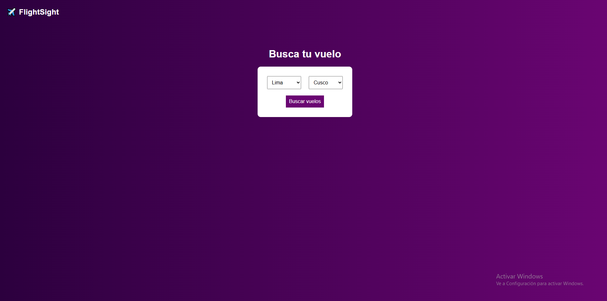
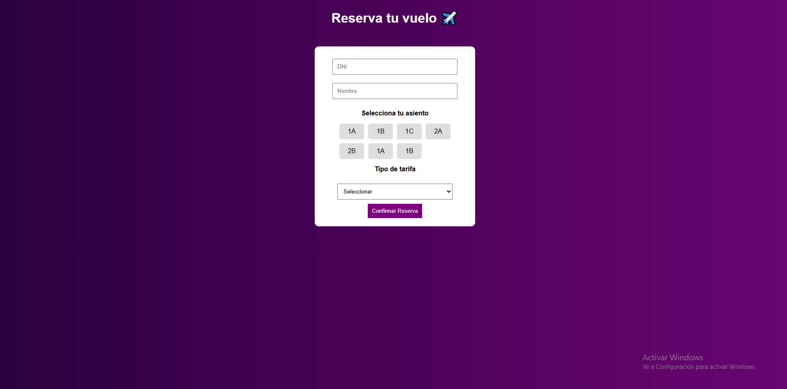

# ✈️ FlightSight - Sistema de Reservas de Vuelos

Aplicación web para búsqueda y reserva de vuelos desarrollada con PHP, MySQL, HTML y CSS.

## Funcionalidades

- Búsqueda de vuelos por origen y destino
- Visualización de vuelos disponibles con horarios
- Selección de asiento interactiva
- Elección de tipo de tarifa
- Confirmación de reserva con datos del pasajero

## Tecnologías

- PHP
- MySQL (18 tablas)
- HTML, CSS, JavaScript
- XAMPP

## Capturas de pantalla

### Búsqueda de vuelos

### Resultados

### Reserva

## Instalación

1. Clonar el repositorio
2. Importar `flightsight.sql` en phpMyAdmin
3. Colocar los archivos en `xampp/htdocs/flightsight`
4. Ejecutar en `http://localhost/flightsight`
